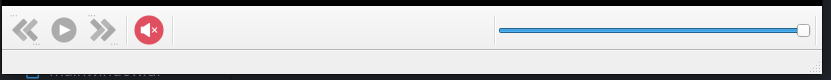
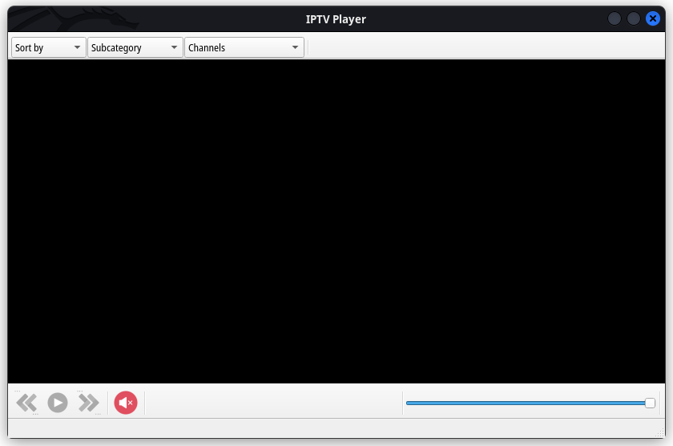
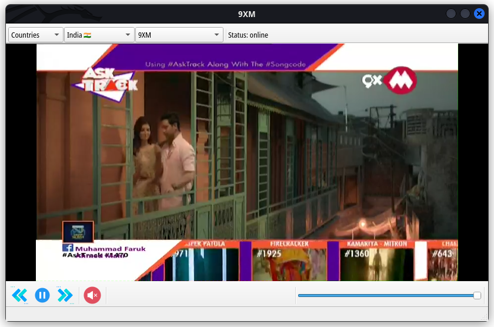
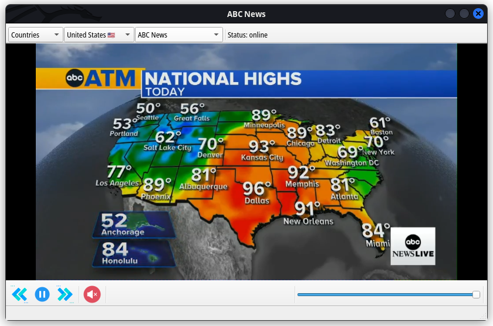
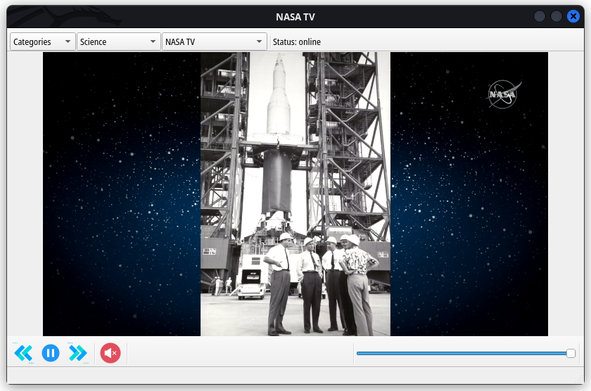
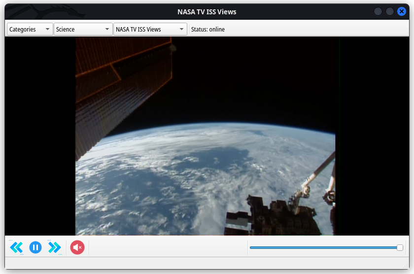

# IPTV Desktop
[](https://saythanks.io/to/0x0is1off@gmail.com)

[](https://discord.gg/PyzaTzs2cF)


## Description
IPTV-Desktop is GUI application made with Qt C++ using [IPTV API](https://github.com/iptv-org/api), which was developed by [iptv-org](https://github.com/iptv-org). Watch free tv channels via internet for free from all over the world in different languages.

It gets updated automatically daily.

For more see [IPTV Project](https://github.com/iptv-org/iptv).


## Requirements
### For Debian and Ubuntu Distro

- Qt (5.13.0+)
- QMake (3.1+)
- gstreamer (1.20.3+)
- GNU Make (4.3+)

### For Arch and Similar distros
- Qt (5.13.0+)
- QMake (3.1+)
- gstreamer (1.20.3+)
- GNU Make (4.3+)
- gst-plugins-bad

## Installation
### For Debian and Ubuntu+

```sh
$ git clone https://github.com/0x0is1/iptv-desktop
$ cd iptv-desktop/src
$ qmake iptv-desktop.pro
$ make
$ ./iptv-desktop
```
## For Arch and related

```sh
$ sudo pacman -S gst-plugins-bad
$ git clone https://github.com/0x0is1/iptv-desktop
$ cd iptv-desktop/src
$ qmake iptv-desktop.pro
$ make
$ ./iptv-desktop
```


## Features

<details>
    <summary>
        Sortable
    </summary>
    
</details>
<details>
    <summary>
        Media Control
    </summary>
    
</details>
<details>
    <summary>
        Compiled binary
    </summary>
    Compiled binary file is also attached in this project. It may work, if Qt libraries are available at your pc.
</details>
<details>
    <summary>
        Sample preview
    </summary>
    
</details>
<details>
    <summary>
        Preview 1
    </summary>
    
</details>
<details>
    <summary>
        Preview 2
    </summary>
    
</details>
<details>
    <summary>
        Preview 3
    </summary>
    
</details>
<details>
    <summary>
        Preview 4
    </summary>
    
</details>

## Copyright
We respect privacy and copyrights, if iptv-org wants to remove this content please reach us by [mail](mailto:://0x0is1@protonmail.com). we will remove the content.

## Feedback

Please consider submitting Issues or Pull Requests, we would love to look on it.

Also you can submit bugs and feedbacks directly to our [email](mailto:://0x0is1@protonmail.com)


### **Support authors**:

If you wanted us to continue  with this type of public use content forever, You may thank us by a coffee or more. Thank you for the contribution. Keep making open source world great <3

[](https://www.buymeacoffee.com/6dciIwk)

[](https://paypal.me/0x0is1?locale.x=en_GB)
